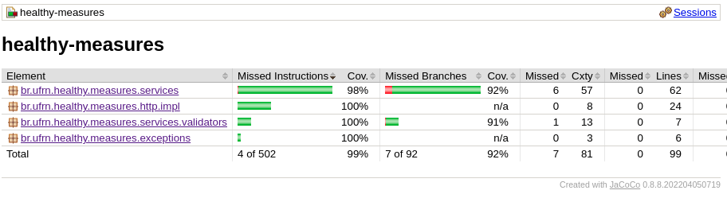
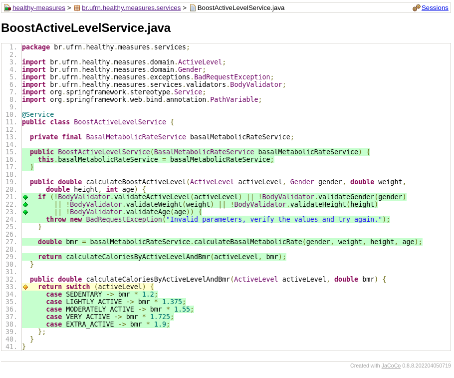

# Healthy Measures

Universidade Federal do Rio Grande do Norte <br>
Departamento de Informática e Matemática Aplicada <br>
Alunos: Frank Laércio da Costa Santos Júnior e Davi Duarte De Freitas <br>
Docente: Roberta De Souza Coelho

## Descrição do Projeto

<p style="text-align: justify">Para o projeto iremos utilizar uma API no padrão REST que irá calcular índices corporais. 
Logo, serão testados 6 endpoints que fazem o cálculo dos seguintes dados: 
Índice de Massa Corporal (IMC), Taxa Metabólica Basal (TMB), Relação Cintura-Quadril (RCQ), 
Taxa de Gordura Corporal, Massa Corporal Magra e Taxa de Metabolismo Ativo. O projeto encontra-se 
disponível no GitHub¹ e pode ser acessado via Swagger ou requisição HTTP pelo link disponível 
na descrição do projeto.</p>

- `GET /shape/bmi?weight={weight}&height={height}`

<p style="text-align: justify">Este endpoint recebe os parâmetros de peso e altura em unidades adequadas 
(por exemplo, peso em quilogramas e altura em metros) e retorna o IMC calculado. 
O IMC é uma medida que relaciona o peso e a altura de uma pessoa e é calculado 
dividindo o peso pela altura ao quadrado.</p>

- `GET /metabolic/bmr?gender={gender}&weight={weight}&height={height}&age={age}`

<p style="text-align: justify">Este endpoint recebe os parâmetros de sexo, peso, altura e idade, 
e retorna a TMB calculada. A TMB é uma estimativa da quantidade de calorias 
que o corpo precisa para manter suas funções básicas em repouso. 
A fórmula para calcular a TMB varia de acordo com o sexo da pessoa.</p>

- `GET /shape/waist-hip-ratio?gender={gender}&waist={waist}&hip={hip}`

<p style="text-align: justify">Este endpoint recebe os parâmetros de medida da circunferência da cintura 
e do quadril e retorna a RCQ calculada. A RCQ é uma medida que avalia a distribuição 
de gordura corporal e é calculada dividindo a circunferência da cintura pela 
circunferência do quadril. Esses são exemplos básicos de endpoints para calcular 
índices corporais. É importante notar que este é apenas um exemplo e que a 
implementação real pode variar dependendo das necessidades específicas e da 
tecnologia utilizada na criação da API.</p>

- `GET /shape/fat-rate?gender={gender}&weight={weight}&height={height}`

<p style="text-align: justify">Este endpoint recebe os parâmetros de sexo, peso, altura, idade, circunferência da cintura 
e circunferência do quadril, e retorna a taxa de gordura corporal estimada. 
A taxa de gordura corporal é uma medida que indica a porcentagem de gordura no corpo em relação 
ao peso total.</p>

- `GET /shape/lean-mass?gender={gender}&weight={weight}&height={height}`

<p style="text-align: justify">Este endpoint recebe os parâmetros de peso e taxa de gordura corporal e retorna a massa corporal 
magra estimada. A massa corporal magra é a parte do peso corporal que corresponde aos músculos, 
órgãos e outros tecidos não gordurosos.</p>

- `GET /metabolic/active-level?active_level={active_level}&gender={gender}&weight={weight}&height={height}&age={age}`

<p style="text-align: justify">Este endpoint recebe o parâmetro de nível de atividade física (por exemplo, sedentário, 
moderado, ativo) e a taxa metabólica basal (TMB) calculada anteriormente. Em seguida, 
retorna a taxa de metabolismo ativo estimada. A taxa de metabolismo ativo é a quantidade de 
calorias que o corpo queima levando em consideração o nível de atividade física. Esses são 
mais exemplos de endpoints que podem ser adicionados à API de cálculos de índices corporais. 
É importante lembrar que os parâmetros e fórmulas utilizados podem variar dependendo das 
necessidades específicas e das referências utilizadas para os cálculos.</p>

## Tecnologias Utilizadas
- [Java](https://www.java.com/pt-BR/)
- [Spring Boot](https://spring.io/projects/spring-boot)
- [Swagger](https://swagger.io/)
- [Docker](https://www.docker.com/)
- [Docker Compose](https://docs.docker.com/compose/)

## Como Executar o Projeto
```bash
cd healthy-measures
docker-compose up
```

## Como Testar o Projeto
```bash
cd healthy-measures
mvn test
```

## Testes Funcionais
<p style="text-align: justify">Testes Funcionais do Projeto
Foram escolhidas as classes do pacote de serviço para realização de testes funcionais. 
Os testes funcionais são responsáveis por validar o comportamento do sistema como um todo, 
garantindo que as funcionalidades principais estejam operando corretamente. 
As classes do pacote de serviço contêm a lógica de negócio e são essenciais para o funcionamento 
correto do sistema. Ao testar essas classes, podemos garantir que as operações de negócio 
estão sendo executadas conforme o esperado e que os resultados estão corretos. Os testes 
funcionais abrangem cenários reais de uso, simulando interações com as classes de serviço 
como se fossem usuários reais utilizando o sistema. Isso envolve enviar solicitações, 
fornecer dados de entrada e verificar os resultados esperados. 
Ao realizar os testes funcionais nas classes do pacote de serviço, é possível identificar 
possíveis problemas na lógica de negócio, erros de cálculos, comportamentos inesperados ou 
falhas na interação com outras camadas do sistema.
Logo, a principal classe a ser testada pensando nos valores limites é a BodyValidator, 
pois é nela que são verificados os valores limites para cada regra de negócio implementada.</p>

## Cobertura de Testes

<p style="text-align: justify">
A cobertura de testes é uma métrica fundamental que indica a porcentagem de código testado. 
Para esse projeto, utilizamos o Jacoco para obter informações sobre o código desenvolvido e o que 
estava sendo verificado. No diretório "target", encontramos uma pasta chamada "site" que contém 
o arquivo index.html, onde é possível verificar a cobertura de testes do projeto. Nesse arquivo, 
podemos analisar tanto a cobertura de testes de uma classe de serviço específica como também 
a cobertura de testes do projeto como um todo. A seguir, apresentamos um exemplo da cobertura 
de testes de uma classe de serviço para ilustrar o processo e também a cobertura geral do projeto.</p>

<p style="text-align: justify">
   
    
<p>

<p style="text-align: justify">
Na classe BoostActiveLevelService, podemos observar que a cobertura de testes atinge 98%. 
Essa porcentagem resulta da falta de testes no método de validação de nível de atividade física, 
o qual apresentou desafios específicos para ser testado devido ao uso do switch no Java 17. 
Apesar disso, é importante ressaltar que a cobertura geral do projeto alcançou 99%, 
desconsiderando apenas o pacote de configuração e domínio, que não envolve lógica de negócio.
</p>

### Docs

The *endpoints* documentation was implemented following the Swagger UI documentation tool.

```
http://localhost:8080/swagger-ui/index.html
```

In this url above, you look for the following endpoints:

- https://api--healthy-measures.azurewebsites.net/
- https://api--healthy-measures.azurewebsites.net/swagger-ui/index.html

### License

This project is licensed under the MIT License - see the LICENSE.md file for more information.
Done with :hearts: :wave:!